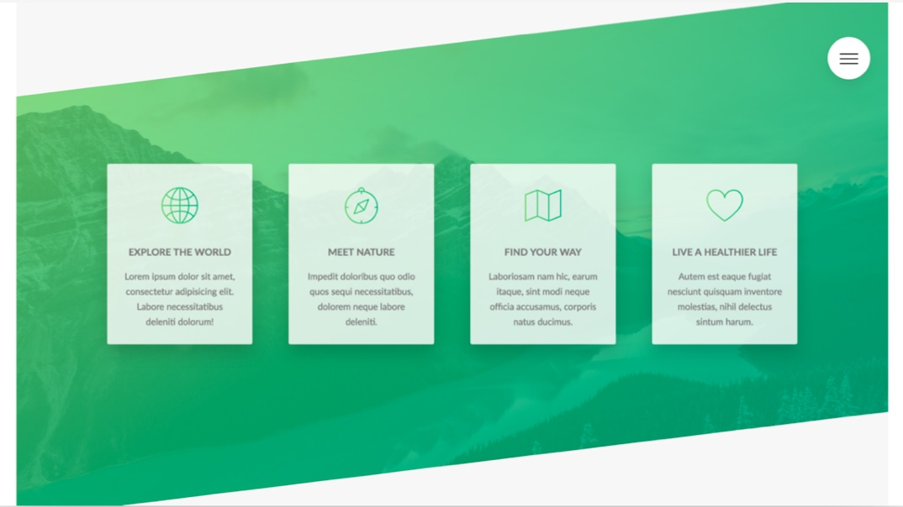

# Advanced-css Summary

Advanced CSS and Sass: Flexbox, Grid, Animations and More! by Jonas Schmedtmann

---

# Details

<details open>
  <summary>Click to Contract/Expend</summary>

### 3. Setting up Our Tools

[VSCode Setup used in the course](https://github.com/jonasschmedtmann/advanced-css-course/blob/master/vscode-setup.md)

[CSS clip-path maker](https://bennettfeely.com/clippy/)

[Emmet Cheat Sheet](https://docs.emmet.io/cheat-sheet/)

### 6. Building the Header - Part 1

clip-path : It creates a clipping region that sets what part of an element should be shown

### 11. Section 3: How CSS Works, Intro

1. Responsive Design
   - Fluid layouts
   - Media queries
   - Responsive images
   - Correct units
   - Desktop-first vs mobile-first
2. Maintainable and scalable code
   - Clean
   - Easy-to-understand
   - Growth
   - Reusable
   - How to organize files
   - How to name classes
   - How to structure HTML
3. Web performance
   - Less HTTP requests
   - Less code
   - Compress code
   - Use a CSS preprocessor
   - Less images
   - Compress images

### 20. CSS Architecture, Components and BEM

[Atomic Design](https://bradfrost.com/blog/post/atomic-web-design/)

[BEM](http://getbem.com/)

[SASS Guideline](https://sass-guidelin.es/)

[The 7-1 Pattern](https://sass-guidelin.es/#the-7-1-pattern)

### 23. What is Sass?

Main SASS Features

- Variables: for reusuable values such as colors, font-sizes, spacing, etc;
- Nesting: to nest selectors inside of one another, allowing us to write less code;
- Operators: for mathematical operations right inside of CSS;
- Partials and imports: to write CSS in different files and importing them all into one single file;
- Mixins: to write reusable pieces of CSS code;
- Functions: similar to mixins, with the difference that they produce a value that can than be used;
- Extends: to make different selectors inherit declarations that are common to all of them;
- Control directives: for writing complex code using conditionals and loops

### 27. NPM Packages: Let's Install Sass Locally

```sh
npm install node-sass --save-dev
npm run compile:sass
```

```json
"scripts": { "compile:sass": "node-sass sass/main.scss css/style.css -w" }
```

### 29. The Easiest Way of Automatically Reloading a Page on File Changes

```sh
npm install -g live-server
live-server
```

### 34. Building a Custom Grid with Floats

- How to architect and build a simple grid system
- How the attribute selector works
- How the _:not_ pseudo-class works
- How _calc()_ works, and what’s the difference between calc() and simple Sass operations

```css
&:not(:last-child) {
  border-bottom: 1px solid $color-grey-light-2;
}

.col-2-of-3 {
  width: calc(
    2 * ((100% - 2 * #{$gutter-horizontal}) / 3) + #{$gutter-horizontal}
  );
}
```

### 35. Building the About Section - Part 1


- How and why to use utility classes
- How to use the _background-clip_ property
- How to transform multiple properties simultaneously
- How to use the _outline-offset_ property together with outline
- How to style elements that are NOT hovered while others are

```css
background-clip__example {
  display: inline-block;
  background-image: linear-gradient(
    to right,
    $color-primary-light,
    $color-primary-dark
  );
  background-clip: text; // firefox, safari
  -webkit-background-clip: text; // chrome, firefox, safari
  color: transparent;
}
```

### 36. Building the About Section - Part 2

[HTML Glyphs](https://css-tricks.com/snippets/html/glyphs/)

### 38. Building the Features Section



- How to include and use an icon font
- Another way of creating the “skewed section”
- How and when to use the direct child selector

[Live Sass Compiler Settings](https://ritwickdey.github.io/vscode-live-sass-compiler/docs/settings.html)

Using Live Sass Compiler extension instead of node-sass which does not watch sometimes.

### 39. Building the Tours Section - Part 1


- How to build an amazing, rotating card
- How to use _perspective_ in CSS
- How to use the _backface-visibility_ property
- Using _background blend modes_
- How and when to use _box-decoration-break_

### 41. Building the Tours Section - Part 3

```css
/* Position Horizontally Vertically Center */
center {
  position: absolute;
  top: 50%;
  left: 50%;
  transform: translate(-50%, -50%);
}
```

### 42. Building the Stories Section - Part 1


- How to make text flow around shapes with _shape-outside_ and _float_
- How to apply a _filter_ to images
- How to create a background video covering an entire section
- How to use the <video> HTML element
- How and when to use the _object-fit_ property

```css
&__content {
  object-fit: cover; // similar to background-size: cover;
}
```

### 44. Building the Stories Section - Part 3

[Coverr](https://coverr.co/): Free Videos

Background Video

### 45. Building the Booking Section - Part 1


- How to implement “solid-color gradients”
- How the general and adjacent sibling selectors work and why we need them
- How to use the _::input-placeholder_ pseudo-element
- How and when to use the _:focus_, _:invalid_, _placeholder-shown_ and _:checked_ pseudo- classes
- Techniques to build custom radio buttons

```css
solid-color-gradients {
  background-image: linear-gradient(
      105deg,
      rgba($color-white, 0.9) 50%,
      transparent 50%
    ), url(../img/nat-10.jpg);
}
```

### 46. Building the Booking Section - Part 2

- : CSS Adjacent Sibling Combinator

```css
&__input:placeholder-shown + &__label {
}
```

### 49. Building the Navigation - Part 1


- What the “checkbox hack” is and how it works
- How to create custom animation timing functions using cubic bezier curves
- How to animate “solid-color gradients”
- How and why to use _transform-origin_
- In general: create an amazingly creative effect!

</details>

---
