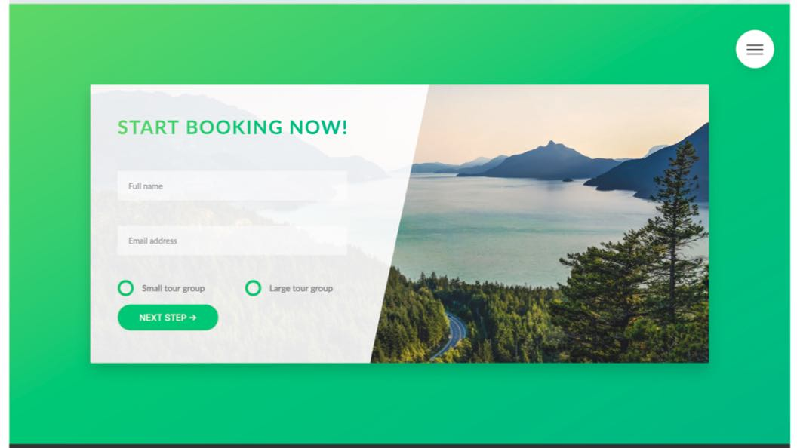
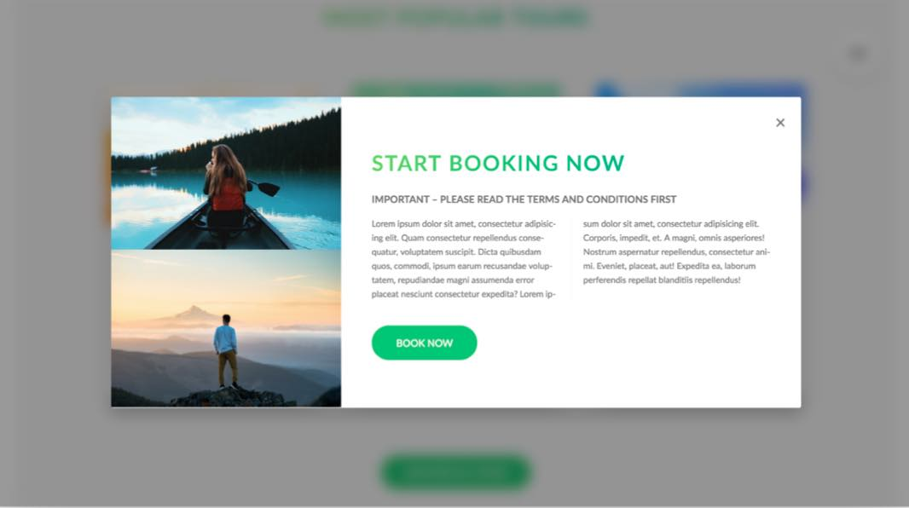

# Advanced-css Summary

Advanced CSS and Sass: Flexbox, Grid, Animations and More! by Jonas Schmedtmann

---

# Project 1. Natours Project

<details open>
  <summary>Click to Contract/Expend</summary>

### 3. Setting up Our Tools

[VSCode Setup used in the course](https://github.com/jonasschmedtmann/advanced-css-course/blob/master/vscode-setup.md)

[CSS clip-path maker](https://bennettfeely.com/clippy/)

[Emmet Cheat Sheet](https://docs.emmet.io/cheat-sheet/)

### 6. Building the Header - Part 1

clip-path : It creates a clipping region that sets what part of an element should be shown

### 11. Section 3: How CSS Works, Intro

1. Responsive Design
   - Fluid layouts
   - Media queries
   - Responsive images
   - Correct units
   - Desktop-first vs mobile-first
2. Maintainable and scalable code
   - Clean
   - Easy-to-understand
   - Growth
   - Reusable
   - How to organize files
   - How to name classes
   - How to structure HTML
3. Web performance
   - Less HTTP requests
   - Less code
   - Compress code
   - Use a CSS preprocessor
   - Less images
   - Compress images

### 20. CSS Architecture, Components and BEM

[Atomic Design](https://bradfrost.com/blog/post/atomic-web-design/)

[BEM](http://getbem.com/)

[SASS Guideline](https://sass-guidelin.es/)

[The 7-1 Pattern](https://sass-guidelin.es/#the-7-1-pattern)

### 23. What is Sass?

Main SASS Features

- Variables: for reusuable values such as colors, font-sizes, spacing, etc;
- Nesting: to nest selectors inside of one another, allowing us to write less code;
- Operators: for mathematical operations right inside of CSS;
- Partials and imports: to write CSS in different files and importing them all into one single file;
- Mixins: to write reusable pieces of CSS code;
- Functions: similar to mixins, with the difference that they produce a value that can than be used;
- Extends: to make different selectors inherit declarations that are common to all of them;
- Control directives: for writing complex code using conditionals and loops

### 27. NPM Packages: Let's Install Sass Locally

```sh
npm install node-sass --save-dev
npm run compile:sass
```

```json
"scripts": { "compile:sass": "node-sass sass/main.scss css/style.css -w" }
```

### 29. The Easiest Way of Automatically Reloading a Page on File Changes

```sh
npm install -g live-server
live-server
```

### 34. Building a Custom Grid with Floats

- How to architect and build a simple grid system
- How the attribute selector works
- How the _:not_ pseudo-class works
- How _calc()_ works, and what’s the difference between calc() and simple Sass operations

```css
&:not(:last-child) {
  border-bottom: 1px solid $color-grey-light-2;
}

.col-2-of-3 {
  width: calc(
    2 * ((100% - 2 * #{$gutter-horizontal}) / 3) + #{$gutter-horizontal}
  );
}
```

### 35. Building the About Section - Part 1


- How and why to use utility classes
- How to use the _background-clip_ property
- How to transform multiple properties simultaneously
- How to use the _outline-offset_ property together with outline
- How to style elements that are NOT hovered while others are

```css
background-clip__example {
  display: inline-block;
  background-image: linear-gradient(
    to right,
    $color-primary-light,
    $color-primary-dark
  );
  background-clip: text; // firefox, safari
  -webkit-background-clip: text; // chrome, firefox, safari
  color: transparent;
}
```

### 36. Building the About Section - Part 2

[HTML Glyphs](https://css-tricks.com/snippets/html/glyphs/)

### 38. Building the Features Section


- How to include and use an icon font
- Another way of creating the “skewed section”
- How and when to use the direct child selector

[Live Sass Compiler Settings](https://ritwickdey.github.io/vscode-live-sass-compiler/docs/settings.html)

Using Live Sass Compiler extension instead of node-sass which does not watch sometimes.

### 39. Building the Tours Section - Part 1


- How to build an amazing, rotating card
- How to use _perspective_ in CSS
- How to use the _backface-visibility_ property
- Using _background blend modes_
- How and when to use _box-decoration-break_

### 41. Building the Tours Section - Part 3

```css
/* Position Horizontally Vertically Center */
center {
  position: absolute;
  top: 50%;
  left: 50%;
  transform: translate(-50%, -50%);
}
```

### 42. Building the Stories Section - Part 1


- How to make text flow around shapes with _shape-outside_ and _float_
- How to apply a _filter_ to images
- How to create a background video covering an entire section
- How to use the <video> HTML element
- How and when to use the _object-fit_ property

```css
&__content {
  object-fit: cover; // similar to background-size: cover;
}
```

### 44. Building the Stories Section - Part 3

[Coverr](https://coverr.co/): Free Videos

Background Video

### 45. Building the Booking Section - Part 1



- How to implement “solid-color gradients”
- How the general and adjacent sibling selectors work and why we need them
- How to use the _::input-placeholder_ pseudo-element
- How and when to use the _:focus_, _:invalid_, _placeholder-shown_ and _:checked_ pseudo- classes
- Techniques to build custom radio buttons

```css
solid-color-gradients {
  background-image: linear-gradient(
      105deg,
      rgba($color-white, 0.9) 50%,
      transparent 50%
    ), url(../img/nat-10.jpg);
}
```

### 46. Building the Booking Section - Part 2

- : CSS Adjacent Sibling Combinator

```css
&__input:placeholder-shown + &__label {
}
```

### 49. Building the Navigation - Part 1


- What the “checkbox hack” is and how it works
- How to create custom animation timing functions using cubic bezier curves
- How to animate “solid-color gradients”
- How and why to use _transform-origin_
- In general: create an amazingly creative effect!

### 50. Building the Navigation - Part 2

[Easing functions](https://easings.net/)

[cubic-bezier](https://cubic-bezier.com/)

### 51. Building the Navigation - Part 3

```css
&::before {
  top: -0.8rem;
  /*
  transform-origin is useful to control rotate when needed
  transform-origin: right;
  transform-origin: left;
  */
}
```

### 52. Building a Pure CSS Popup - Part 1



- How to build a nice popup with only CSS
- How to use the _:target_ pseudo-class
- How to create boxes with equal height using _display: table-cell_
- How to create CSS text columns
- How to automatically hyphenate words using _hyphens_

One way of vertical alignment

```css
&__content {
  display: table;
}

&__left {
  width: 33.333333%;
  display: table-cell;
}

&__right {
  width: 66.666667%;
  display: table-cell;
  vertical-align: middle;
}
```

### 55. Mobile-First vs Desktop-First and Breakpoints

[Screen Resolution Stats Worldwide](https://gs.statcounter.com/screen-resolution-stats#monthly-202006-202106-bar)

### 57. Writing Media Queries - Base, Typography and Layout

ORDER:

1. Base + typography
2. grid + general layout
3. page layout > components

### 59. Writing Media Queries - Tours, Stories and Booking Sections

[Suzzy - Varius device screen testing](https://sizzy.co/)

### 61. Responsive Images in HTML - Art Direction and Density Switching


- How to use the srcset attribute on the  and <source> elements, together with density descriptors
- How and why to use the <picture> element for art direction
- How to write media queries in HTML.

```html
<source
  srcset="img/logo-green-small-1x.png 1x, img/logo-green-small-2x.png 2x"
  media="(max-width: 37.5em)"
/>

```

### 62. Responsive Images in HTML - Density and Resolution Switching

- How to allow the browser to decide the best image to download, using the srcset attribute, width descriptors, and the sizes attribute of the  element.

```html

```

[MDN Responsive images](https://developer.mozilla.org/en-US/docs/Learn/HTML/Multimedia_and_embedding/Responsive_images)

> Confusing still as it doesn't work as it was supposed to on chrome devtool \
> "The browser loads the image referenced in the srcset list that has the same size as the slot or, if there isn't one, the first image that is bigger than the chosen slot size."

### 63. Responsive Images in CSS

- How to implement responsive images in CSS
- How to use resolution media queries to target high-resolution screens with 2x
- How to combine multiple conditions in media queries.

```css
@media (min-resolution: 192dpi) and (min-width: 37.5em), (min-width: 112.5em) {
  background-image: linear-gradient(
      to right bottom,
      rgba($color-secondary-light, 0.8),
      rgba($color-secondary-dark, 0.8)
    ), url(../img/hero.jpg);
}
```

### 64. Testing for Browser Support with @supports

[CANIUSE](https://caniuse.com/)

- How to use _@supports_ feature queries
- Implement graceful degradation on selected
- How to use _backdrop-filter_

### 65. Setting up a Simple Build Process with NPM Scripts

```sh
# concatenate two files
npm install concat --save-dev
# Add prefixes such as -webkit-, -moz-, -o-, Etc.
npm install autoprefixer postcss-cli postcss --save-dev
# run several npm commands at once
npm install npm-run-all --save-dev

npm run build:css

npm start
```

### 66. Wrapping up the Natours Project: Final Considerations

[W3 Media Types](https://www.w3.org/TR/CSS21/media.html%23media-types)

```css
/* only screen */
@media only screen and (max-width: 37.5em) {
}

/* Color changing when you select texts */
::selection {
  background-color: $color-primary;
  color: $color-white;
}

/* for touchable devide like iPad (landspace) */
@media only screen and (hover: none) {
}
```

</details>

# Project 2. Trillo Project

<details open>
  <summary>Click to Contract/Expend</summary>

### 68. Why Flexbox: An Overview of the Philosophy Behind Flexbox

Flexbox completely changes the way that we build one-dimensional layouts.

Container for Flex : Main Axis

1. flex-direction: row | row-reverse | column | column-reverse
2. flex-wrap: nowrap | wrap | wrap-reverse
3. justify-content: flex-start | flex-end | center | space-between | space-around | space-evenly
   - Main Axis Alignment
4. align-items: stretch | flex-start | flex-end | center | baseline
   - Cross Axis Alignment
5. align-content: stretch | flex-start | flex-end | center | space-between | space-around

Item for Flex : Cross Axis

1. align-self: auto | stretch | flex-start | flex- end | center | baseline
2. order: 0 | <integer>
3. flex: 0 1 auto | <int> <int> <len>
   1. flex-grow: 0 | <integer>
   2. flex-shrink: 1 | <integer>
   3. flex-basis: auto | <length>

### 75. Building the Header - Part 1

[IcoMoon : Free SVG & Icons](https://icomoon.io/app/)

> xlink:href is only working on a web server

```html
<svg class="search__icon">
  <use xlink:href="img/sprite.svg#icon-magnifying-glass" />
</svg>
```

```sh
# Run one more server for the final version to compare
advanced-css-course-starter-jonas/Trillo/final % live-server --port=9090
```

### 76. Building the Header - Part 2

input element doesn't inherit font-family and font-size

### 78. Building the Navigation - Part 1

- How to use _scaleY_ and multiple transition properties with different settings, to create a creative hover effect
- How and why to use the _currentColor_ CSS variable
- How to use some more advanced flexbox alignment techniques, including _flex-direction_, _justify-content_ and _align-items_.

```css
/* inherit color from itself or its parent */
&__icon {
  fill: currentColor;
}
```

### 80. Building the Hotel Overview - Part 1

flex - margin-right trick. \
-> works the same as flex but not actually occupying whole width

```css
.overview {
  display: flex;
  &__heading {
  }
  &__stars {
    /* flex: 1; */
    margin-right: auto;
    background-color: orangered;
  }
}
```

### 82. Building the Description Section - Part 1

VSCode -> Expand Selection (Ctrl + Shift + ->)

</details>

---
